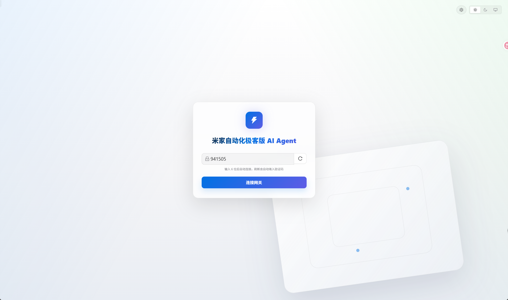
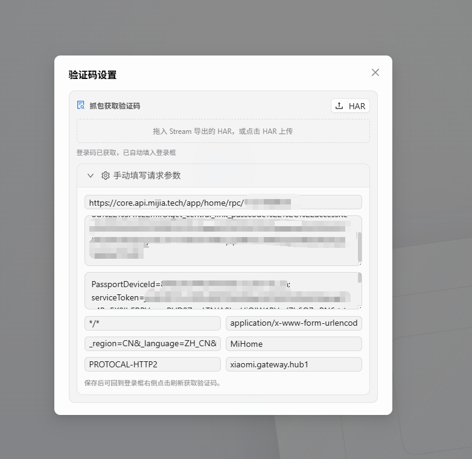

# Oh My Sage

> 米家自动化极客版 AI Agent - 用自然语言创建和管理复杂的米家极客版自动化规则

[](https://nextjs.org/)
[](https://www.typescriptlang.org/)
[](https://sdk.vercel.ai/)

Oh My Sage 是一个 Web 界面的工具驱动 AI Agent，通过自然语言对话帮助你连接小米中枢网关、查看设备、创建和管理米家自动化极客版规则。可实现免手机登录极客版，利用接口模拟设备发送请求，获取验证码。这样就不用拿手机在app获取中枢网关了，直接在浏览器插入验证码即可登录

---

## 核心特性

- **Web 界面** - 浏览器交互，可视化查看设备、规则和对话
- **无独立 MCP 服务** - 已移除 MCP Server，Web API routes 直接调用后端工具和网关单例，fnOS 只需要运行 Next.js standalone 服务
- **Agent 循环** - 持续运行的思考-行动循环，非一次性响应
- **工具驱动** - 所有设备和规则能力通过工具实现
- **思考可见** - 输出思考过程，让你了解 Agent 在做什么
- **多方案建议** - 为自动化规则提供多种实现方案
- **确认后执行** - 重要操作前获取确认
- **自动获取验证码** - 支持解析 Stream/HAR 抓包文件，保存请求参数，并在下次打开页面时自动刷新 6 位米家登录码
- **流式输出** - 实时显示处理过程
- **fnOS Native 打包** - Next.js standalone 服务可复制进 FPK 包布局

---

## 界面预览

### 自动获取登录码



### fnOS 运行设置



---

---

## 在 fnOS 上安装和使用

### 前置条件

- 在飞牛 fnOS 应用中心先安装 **Node.js v22**。
- 准备一个 OpenAI 兼容的 LLM 接口，例如 OpenAI、通义千问、DeepSeek、Kimi、Ollama 等。
- 准备小米中枢网关的局域网 IP 和 6 位登录码。

如果启用应用时提示 `Node.js runtime not found` 或“未找到 Node.js 运行时环境”，通常是 fnOS 的 Node.js 运行时入口没有正确刷新。先在 fnOS 应用中心卸载并重新安装 **Node.js v22**，再重新启用 Oh My Sage。

### 安装 FPK

1. 在 fnOS 中安装 `fnnas.oh-my-sage.fpk`。
2. 安装向导中填写 LLM 配置：
   - `LLM_BASE_URL`：OpenAI 兼容接口地址，通常以 `/v1` 结尾。
   - `LLM_API_KEY`：接口密钥。
   - `LLM_MODEL`：模型名称，例如 `gpt-4o`、`deepseek-chat`。
   - `LLM_TEMPERATURE`：生成温度，默认 `0.7`。
3. 填写应用端口，默认是 `3000`。如果端口被占用，可以改成其他端口，例如 `3100`。
4. 选择中枢版本并填写网关 IP，例如 `192.168.0.5`，不要填写 `http://`、`https://`、端口或路径。实体版中枢会自动生成 `GATEWAY_URL=http://IP`，路由器版中枢会自动生成 `GATEWAY_URL=http://IP:8086`。
5. 安装完成后启用应用，从 fnOS 应用入口打开 Oh My Sage，或访问 `http://<fnOS地址>:<应用端口>/`。

### 首次使用

1. 打开 Oh My Sage Web 界面。
2. 输入小米中枢网关的 6 位登录码并连接网关。
3. 如果不方便手动查看登录码，可以在验证码输入框下方上传或拖入 Stream 导出的 HAR 文件。应用会自动解析米家极客版登录码请求，获取到 6 位验证码后点击“插入”即可填入输入框。
4. 解析出的请求参数会保存在浏览器本地存储中，下次打开页面时会自动尝试刷新验证码。也可以点击刷新按钮重新请求。
5. 也可以展开“手动填写请求参数”，粘贴请求地址、POST 数据和 Cookie 等抓包信息，点击“获取验证码”模拟请求。
6. 连接成功后，可以在聊天框中用自然语言查看设备、查询自动化规则，或创建米家自动化极客版规则。

### 修改设置

安装后可以在 fnOS 的应用设置中修改 LLM 配置、应用端口、中枢版本和网关 IP。设置保存后，如果应用正在运行，脚本会自动重启服务让新配置生效。

应用配置会写入 `${TRIM_PKGETC}/oh-my-sage.env`，会话数据保存在 `${TRIM_PKGVAR}/sessionstore`。启动日志写入 `${TRIM_PKGVAR}/oh-my-sage.log`，启动失败时也会把关键错误同步到 fnOS 应用中心显示的错误日志。

### 常见问题

- **无法启用，提示 Node.js runtime not found**：在 fnOS 应用中心卸载并重新安装 **Node.js v22**，然后重新启用 Oh My Sage。
- **页面打不开**：确认安装向导中的应用端口没有被其他应用占用，并检查 fnOS 防火墙或反向代理设置。
- **网关连接失败**：确认 fnOS 和小米中枢网关在同一局域网，中枢版本选择正确，网关 IP 填写的是纯 IP，登录码仍然有效。
- **HAR 未识别出登录码请求**：确认抓包中包含 `POST https://core.api.mijia.tech/app/home/rpc/...` 或其他 `mijia.tech`/`api.io.mi.com` 的米家极客版登录码请求。
- **LLM 无响应**：确认 `LLM_BASE_URL`、`LLM_API_KEY` 和 `LLM_MODEL` 与所使用的服务商一致。

---


支持任何 OpenAI 兼容接口，例如 OpenAI、通义千问、DeepSeek、Kimi、本地 Ollama 等。


## 项目结构

```text
oh-my-sage/
├── .agents/
│   └── skills/
│       └── mijia-automation/ # 米家自动化规则创建指南
├── fnnas.oh-my-sage/         # fnOS Native 应用包布局
├── scripts/
│   └── prepare-fpk.mjs       # 复制 Next.js standalone 产物
├── src/
│   ├── app/                  # Next.js App Router 和 API routes
│   ├── components/           # React 组件
│   ├── core/                 # 网关客户端、工具实现、类型定义
│   └── server/               # Web 后端 Agent、LLM、Session、Gateway 单例
├── ref/                      # 米家网关参考资料
└── docs/                     # 项目文档和截图
```


## 参考文档

- [米家网关参考文档](ref/GUIDE.md)
- [Agent Skills 规范](.agents/skills/mijia-automation/SKILL.md)
- [fnOS 打包说明](docs/FNNAS_PACKAGING.md)

---

## License

MIT License - 详见 [LICENSE](LICENSE) 文件
